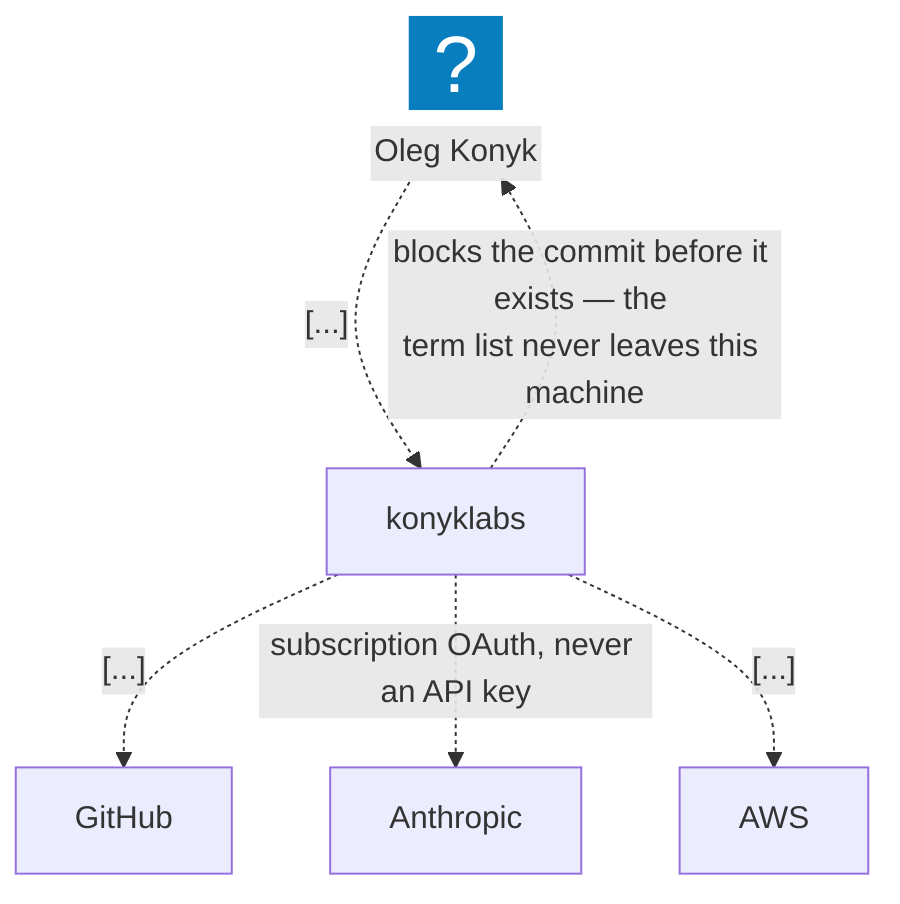
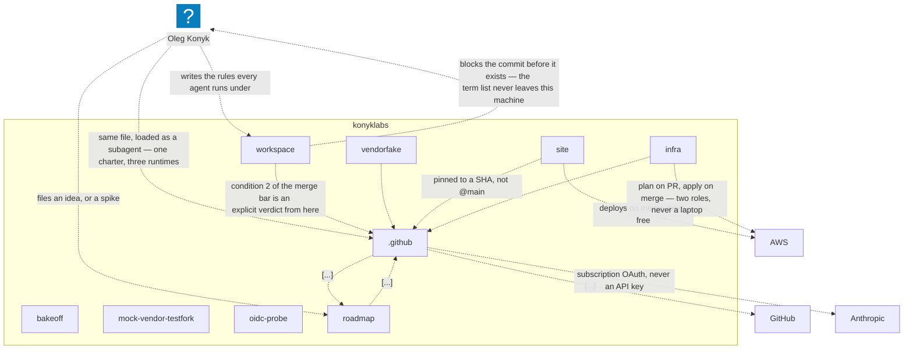
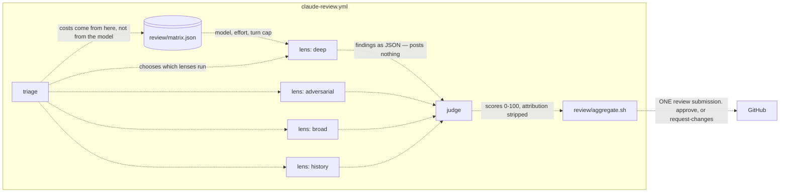
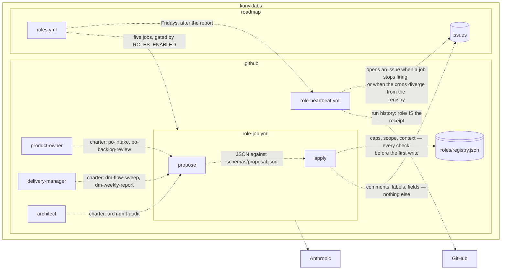
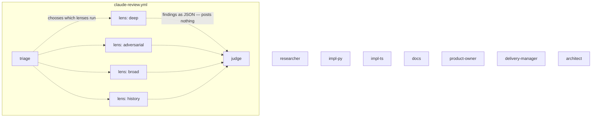
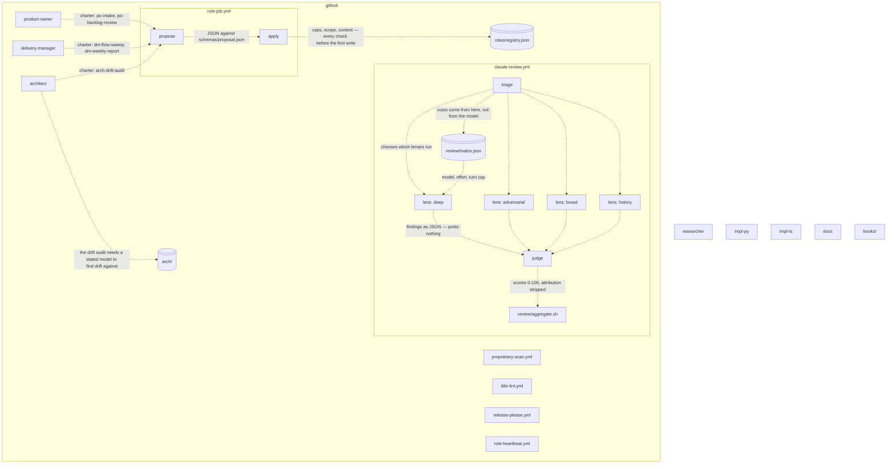
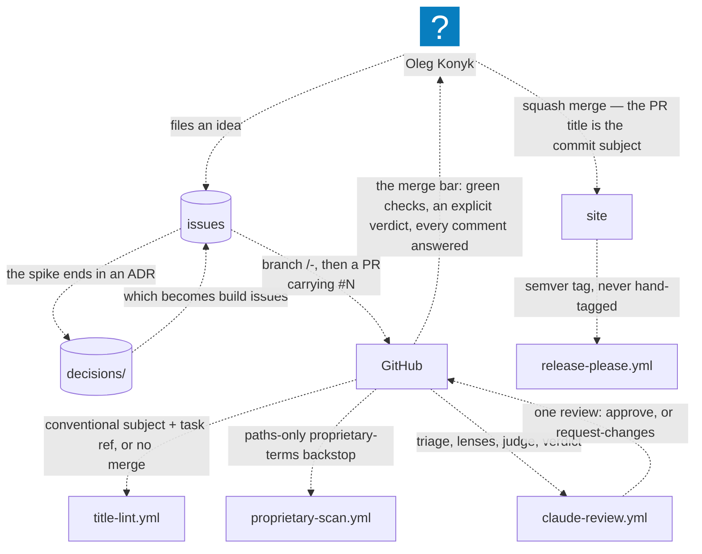
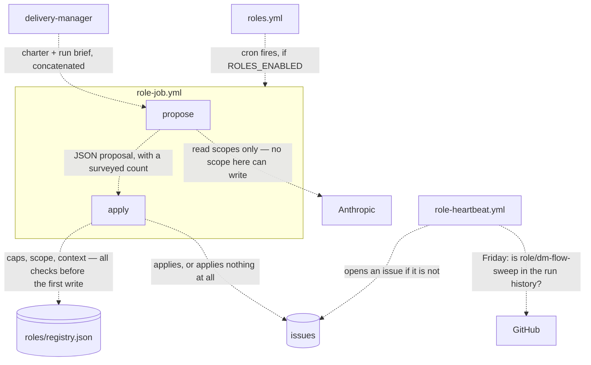

<!-- Generated by arch/bin/gen.sh. Do not edit. -->

# konyklabs — the views

Source: [`arch/model`](../model). Regenerate: `npm --prefix arch run gen`.

## konyklabs — the whole thing

## The repositories, and who calls the shared workflows

## The PR review gate

## The clock — what runs unattended

## Every agent in the org

## Where a model is trusted, and where it is not

## How one change becomes a release

## One unattended role run

